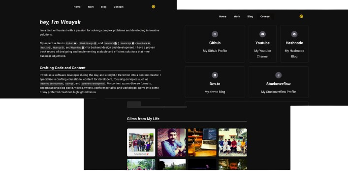
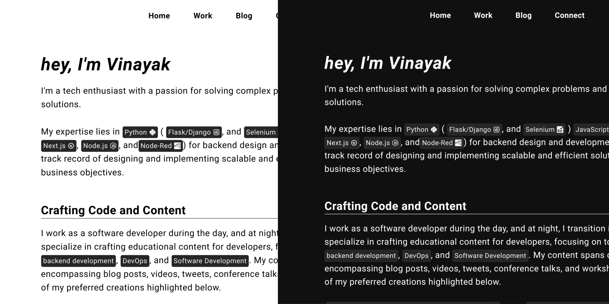

# DarkNexfolio


[](https://github.com/itsvinayak/itsvinayak.github.io/actions/workflows/nextjs.yml) 

[Preview Link](https://itsvinayak.vercel.app/)

DarkNexfolio is a sleek and responsive personal website built with Next.js, designed to showcase your portfolio with a sophisticated dark theme. Whether you're a developer, designer, or creative professional, DarkNexfolio provides a modern and immersive experience for your visitors.

<p align="center">


  
</p>


---


## Getting Started

- Clone the Repository:
```bash
git clone https://github.com/itsvinayak/itsvinayak.github.io.git
```

- Install Dependencies:
```bash
cd itsvinayak.github.io
npm install
```

- Run the Development Server:
```bash
npm run dev
```
Your DarkNexfolio will be accessible at http://localhost:3000.

## Features
### Light and Dark Theme
This template comes equipped with a seamless light and dark theme. It intelligently detects the user's preferred color scheme, automatically transitioning to it. Alternatively, users can manually switch between the light and dark modes by clicking on the sun/moon icon located at the top right corner of the page.




